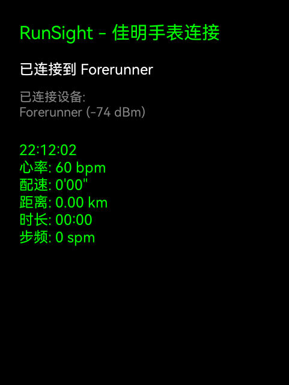
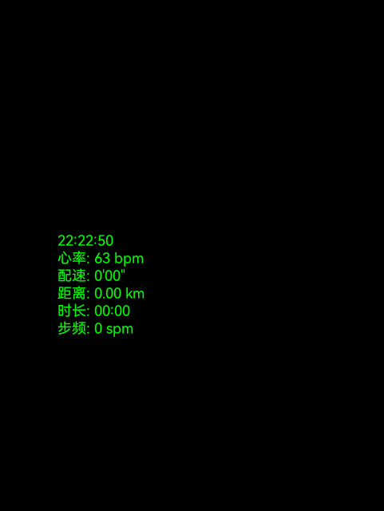

# Runsight

一个专为Rokid Glasses和佳明手表设计的Android应用，通过蓝牙标准服务实时获取和显示运动数据。

## 应用截图

<div align="center">
  
  
</div>

*左图：应用主界面，显示设备连接状态；右图：数据显示界面，实时显示运动数据*

## 项目简介

Runsight是一个轻量级的Android应用，专门用于连接佳明（Garmin）智能手表，通过蓝牙低功耗（BLE）技术获取实时运动数据。应用采用简洁的界面设计，专注于核心功能的实现。

## 主要功能

- **蓝牙设备扫描**: 自动扫描并识别佳明手表设备
- **实时数据获取**: 通过RSC（Running Speed and Cadence）和HRM（Heart Rate Monitor）服务获取运动数据
- **数据实时显示**: 显示心率、配速、距离、步频等运动指标
- **双页面模式**: 支持主页面和数据页面切换
- **亮度控制**: 支持通过按键调节屏幕亮度
- **权限管理**: 自动处理蓝牙和位置权限请求

## 技术特点

- **轻量化设计**: 移除了复杂的UI框架，使用传统Android View系统
- **标准蓝牙服务**: 基于蓝牙标准服务协议，兼容性更好
- **实时数据处理**: 高效的数据解析和显示机制
- **简洁架构**: MVVM架构模式，代码结构清晰

## 项目结构

```
app/
├── src/main/java/com/mouzhi/runsight/
│   ├── SimpleMainActivity.kt          # 主Activity，处理UI和用户交互
│   ├── ui/
│   │   ├── viewmodel/
│   │   │   └── RunSightViewModel.kt   # 数据管理和业务逻辑
│   │   └── theme/                     # UI主题配置
│   ├── data/
│   │   ├── models/                    # 数据模型
│   │   └── repository/                # 数据仓库层
│   ├── bluetooth/
│   │   └── BluetoothManager.kt        # 蓝牙连接和数据获取
│   └── utils/
│       ├── BrightnessManager.kt       # 亮度控制
│       └── DebugLogger.kt             # 调试日志
└── src/main/AndroidManifest.xml       # 应用配置和权限声明
```

## 使用说明

### 安装要求

- Android 6.0 (API 23) 或更高版本
- 支持蓝牙低功耗（BLE）的设备
- 佳明智能手表（支持RSC和HRM服务）

### 使用步骤

1. **安装应用**: 下载并安装APK文件
2. **授予权限**: 首次启动时授予蓝牙和位置权限
3. **连接手表**: 应用会自动扫描并连接佳明手表
4. **查看数据**: 连接成功后即可查看实时运动数据
5. **页面切换**: 按确认键（DPAD_CENTER）切换主页面和数据页面
6. **亮度调节**: 使用左右方向键调节屏幕亮度

### 按键操作

- **确认键**: 切换页面模式
- **左方向键**: 降低屏幕亮度
- **右方向键**: 增加屏幕亮度

## 开发环境

- **开发工具**: Android Studio
- **编程语言**: Kotlin
- **最低SDK**: API 23 (Android 6.0)
- **目标SDK**: API 34 (Android 14)
- **构建工具**: Gradle 8.13

## 编译说明

### 环境准备

1. 安装Android Studio
2. 配置Android SDK
3. 克隆项目到本地

### 编译步骤

```bash
# 克隆项目
git clone https://github.com/mouzhi/Runsight.git
cd Runsight

# 编译调试版本
./gradlew assembleDebug

# 编译发布版本
./gradlew assembleRelease -x lintVitalAnalyzeRelease
```

### 安装到设备

```bash
# 安装调试版本
adb install app/build/outputs/apk/debug/app-debug.apk

# 安装发布版本
adb install app/build/outputs/apk/release/app-release-unsigned.apk
```

## 蓝牙服务说明

应用使用以下标准蓝牙服务获取数据：

- **RSC服务** (Running Speed and Cadence): 获取跑步速度、配速、距离等数据
- **HRM服务** (Heart Rate Monitor): 获取心率数据

这些都是蓝牙标准服务，具有良好的设备兼容性。

## 故障排除

### 常见问题

1. **无法发现设备**
   - 确保手表蓝牙已开启
   - 检查应用权限是否已授予
   - 尝试重启蓝牙功能

2. **连接失败**
   - 确保手表处于可连接状态
   - 检查手表是否已与其他设备配对
   - 尝试重启应用

3. **数据不更新**
   - 确保手表处于运动模式
   - 检查RSC和HRM服务是否可用
   - 查看调试日志获取详细信息

## 版本历史

### v1.1.0 (最新版本)
- 重构项目架构，移除冗余代码
- 优化蓝牙连接稳定性
- 简化UI界面，提升性能
- 修复数据显示位置问题

### v1.0.0
- 初始版本发布
- 基本的蓝牙连接功能
- 运动数据获取和显示
- 佳明设备集成

## 贡献指南

欢迎提交Issue和Pull Request来改进项目。

### 开发规范

- 使用Kotlin编程语言
- 遵循Android开发最佳实践
- 保持代码简洁和注释完整
- 提交前进行充分测试

## 许可证

本项目采用MIT许可证，详见LICENSE文件。

## 联系方式

- 项目地址: https://github.com/mouzhi/Runsight
- 问题反馈: 请在GitHub上提交Issue

---

**注意**: 本应用专为佳明手表设计，其他品牌设备的兼容性可能有限。

This repository contains the Runsight project, an Android application for fitness tracking and data analysis.

## Features
- Real-time heart rate monitoring
- Running speed and cadence tracking
- Data synchronization with external devices

## Setup
1. Clone the repository.
2. Open the project in Android Studio.
3. Build and run the application on a compatible device.

## License
This project is licensed under the MIT License.
