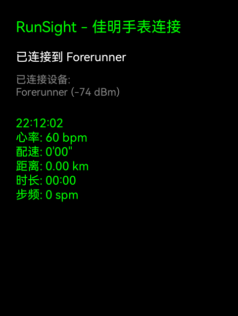
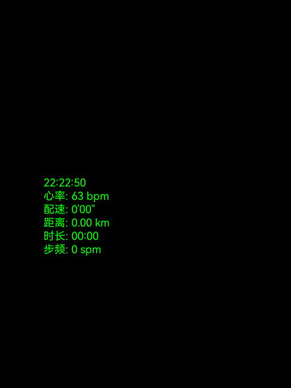

# Runsight

一个专为Rokid Glasses和佳明手表设计的Android应用，通过蓝牙标准服务实时获取和显示运动数据。
我只测试了我自己的手表佳明255，根据其他用户的反馈，部分佳明手表连接后可能并不能显示数据，说明佳明不同型号的蓝牙广播格式应该是不同的
我确实没办法购买所有的佳明手表来测试和兼容，好在这是个开源项目，建议大家在安卓手机上下载一个nRconnect软件连接自己的手表运动模式，订阅里面的的服务并进行抓包
将抓包的LOG分析一下即可兼容自己的手表

## 应用截图

<div align="center">
  
  
</div>

*左图：应用主界面，显示设备连接状态；右图：数据显示界面，实时显示运动数据*

## 项目简介

Runsight是一个轻量级的Android应用，专门用于连接佳明（Garmin）智能手表，通过蓝牙低功耗（BLE）技术获取实时运动数据。应用采用简洁的界面设计，专注于核心功能的实现。

## 主要功能

- **蓝牙设备扫描**: 自动扫描并识别佳明手表设备
- **实时数据获取**: 通过RSC（Running Speed and Cadence）和HRM（Heart Rate Monitor）服务获取运动数据
- **数据实时显示**: 显示心率、配速、距离、步频等运动指标
- **双页面模式**: 支持主页面和数据页面切换
- **亮度控制**: 支持通过按键调节屏幕亮度
- **权限管理**: 自动处理蓝牙和位置权限请求

## 技术特点

- **轻量化设计**: 移除了复杂的UI框架，使用传统Android View系统
- **标准蓝牙服务**: 基于蓝牙标准服务协议，兼容性更好
- **实时数据处理**: 高效的数据解析和显示机制
- **简洁架构**: MVVM架构模式，代码结构清晰
- **正式签名**: 支持APK签名，可正式发布到应用商店

## 项目结构

```
app/
├── src/main/java/com/mouzhi/runsight/
│   ├── SimpleMainActivity.kt          # 主Activity，处理UI和用户交互
│   ├── ui/
│   │   ├── viewmodel/
│   │   │   └── RunSightViewModel.kt   # 数据管理和业务逻辑
│   │   └── theme/                     # UI主题配置
│   ├── data/
│   │   ├── models/                    # 数据模型
│   │   └── repository/                # 数据仓库层
│   ├── bluetooth/
│   │   └── BluetoothManager.kt        # 蓝牙连接和数据获取
│   └── utils/
│       ├── BrightnessManager.kt       # 亮度控制
│       └── DebugLogger.kt             # 调试日志
└── src/main/AndroidManifest.xml       # 应用配置和权限声明
```

## 使用说明

### 安装要求

- Android 6.0 (API 23) 或更高版本
- 支持蓝牙低功耗（BLE）的设备
- 佳明智能手表（支持RSC和HRM服务）

### 使用步骤

1. **安装应用**: 下载并安装APK文件
2. **授予权限**: 首次启动时授予蓝牙和位置权限
3. **连接手表**: 应用会自动扫描并连接佳明手表
4. **查看数据**: 连接成功后即可查看实时运动数据
5. **页面切换**: 按确认键（DPAD_CENTER）在首页、数据页、竞赛页之间循环切换
6. **亮度调节**: 仅在首页使用左右方向键调节屏幕亮度

### 按键操作

- **确认键**：切换页面模式（首页 → 数据页 → 竞赛页 → 首页）
- **首页左右方向键**：降低 / 增加屏幕亮度
- **数据页上下方向键**：切换运动目标距离（默认全马，可切换 5K / 10K / 半马 / 全马）
- **竞赛页上下方向键**：
  - 单次滑动无效
  - 连续双前滑 / 双后滑：修正竞赛页显示距离
- **竞赛页左右方向键**：左右组合重置比赛起点

#### 竞赛页交互（v1.3.2）
- **重置比赛起点**：连续做一次“右滑”后在1.5秒内“左滑”，或“左滑”后在1.5秒内“右滑”
  - 效果：清零竞赛页显示的“距离”和“跑步时间”，并显示提示语“已重置比赛起点”（1.5秒）
  - 说明：第二页的原始距离保留，用于后续精确积分计算；竞赛页显示距离=原始距离差值+修正量
- **修正距离（只影响竞赛页显示）**：
  - 双后滑（≤800ms）：向下取整；如果当前已为整数或5秒内再次修正，则直接-1km（不低于0）
  - 双前滑（≤800ms）：向上取整；如果当前已为整数或5秒内再次修正，则直接+1km
- **预计用时**：按“已用时 + 剩余距离 × 实时配速”实时计算；实时配速缺失时回退平均配速
  - 目标距离来自第二页选择的 5K / 10K / 半马 / 全马
  - 文案格式：`(5K)预计用时` / `(10K)预计用时` / `(半马)预计用时` / `(全马)预计用时`

## 开发环境

- **开发工具**: Android Studio
- **编程语言**: Kotlin
- **最低SDK**: API 23 (Android 6.0)
- **目标SDK**: API 34 (Android 14)
- **构建工具**: Gradle 8.13

## 编译说明

### 环境准备

1. 安装Android Studio
2. 配置Android SDK
3. 克隆项目到本地

### 编译步骤

```bash
# 克隆项目
git clone https://github.com/mouzhi/Runsight.git
cd Runsight

# 编译调试版本
./gradlew assembleDebug

# 编译发布版本
./gradlew assembleRelease -x lintVitalAnalyzeRelease
```

### 安装到设备

```bash
# 安装调试版本
adb install app/build/outputs/apk/debug/app-debug.apk

# 安装发布版本（已签名）
adb install app/build/outputs/apk/release/app-release.apk
```

### 下载安装

你也可以直接从GitHub Releases页面下载最新版本的APK文件：

📱 **[下载最新版本 v1.3.1](https://github.com/mouzhi/Runsight/releases/latest)**

- `Runsight-v1.3.1-signed.apk` - 正式发布版本（推荐）

## 蓝牙服务说明

应用使用以下标准蓝牙服务获取数据：

- **RSC服务** (Running Speed and Cadence): 获取跑步速度、配速、距离等数据
- **HRM服务** (Heart Rate Monitor): 获取心率数据

这些都是蓝牙标准服务，具有良好的设备兼容性。

## 故障排除

### 常见问题

1. **无法发现设备**
   - 确保手表蓝牙已开启
   - 检查应用权限是否已授予
   - 尝试重启蓝牙功能

2. **连接失败**
   - 确保手表处于可连接状态
   - 检查手表是否已与其他设备配对
   - 尝试重启应用

3. **数据不更新**
   - 确保手表处于运动模式
   - 检查RSC和HRM服务是否可用
   - 查看调试日志获取详细信息

## 版本历史

### v1.3.2 (最新版本)
- 恢复并固化三页导航：首页 / 数据页 / 竞赛页
- 首页：左右仅控制亮度
- 数据页：上下切换目标距离（5K / 10K / 半马 / 全马，默认全马）
- 竞赛页：单次上下无效；连续上下修正显示距离；左右组合重置起点
- 预计用时按第二页目标距离计算，并显示 `(5K/10K/半马/全马)预计用时`

### v1.3.1
- 新增：竞赛页“跑步时间 hh:mm”显示，重置起点后从0计时
- 新增：组合操作重置起点（左→右或右→左），清零显示距离与跑步时间
- 新增：双左滑/双右滑距修（仅影响竞赛页显示）
  - 双左滑：向下取整；若已整数或5秒内再次修正，则直接-1km
  - 双右滑：向上取整；若已整数或5秒内再次修正，则直接+1km
  - 与亮度增减并存，不互相影响
- 优化：竞赛页右侧“配速/步频/心率”整体下移一行，布局更清晰
- 算法：预计用时 = 已用时 + 剩余距离 × 实时配速；实时配速不可用时回退平均配速
- 竞赛页距离来源：以第二页原始距离（蓝牙速度积分）为基线，重置后以“原始距离差值 + 人工修正”显示

### v1.3.0
- 新增：第三个竞赛仪表页，安全显示区域适配（480×400）
- 新增：比赛起点重置提示与组合操作（左→右或右→左）
- 优化：日期与电量移至不安全上下边区域，避免遮挡核心信息
- 更新：预计完赛显示为“预计用时”，算法基于剩余距离×实时配速 + 已用时

### v1.2.0
- 新增：应用前台运行时保持屏幕常亮
- 新增：返回桌面后自动恢复系统5秒息屏策略
- 优化：在具备系统写权限时进入前台提高系统息屏超时，退出时自动恢复原值

### v1.1.1
- 修复左右按键亮度调节功能失效问题
- 添加APK签名配置，支持正式发布
- 更新版本号和构建配置
- 生成可正式发布的签名APK文件
- 完善项目文档和截图展示

### v1.1.0
- 重构项目架构，移除冗余代码
- 优化蓝牙连接稳定性
- 简化UI界面，提升性能
- 修复数据显示位置问题

### v1.0.0
- 初始版本发布
- 基本的蓝牙连接功能
- 运动数据获取和显示
- 佳明设备集成

## 贡献指南

欢迎提交Issue和Pull Request来改进项目。

### 开发规范

- 使用Kotlin编程语言
- 遵循Android开发最佳实践
- 保持代码简洁和注释完整
- 提交前进行充分测试

## 许可证

本项目采用MIT许可证，详见LICENSE文件。

## 联系方式

- 项目地址: https://github.com/mouzhi/Runsight
- 问题反馈: 请在GitHub上提交Issue

---

**注意**: 本应用专为佳明手表设计，其他品牌设备的兼容性可能有限。

This repository contains the Runsight project, an Android application for fitness tracking and data analysis.

## Features
- Real-time heart rate monitoring
- Running speed and cadence tracking
- Data synchronization with external devices

## Setup
1. Clone the repository.
2. Open the project in Android Studio.
3. Build and run the application on a compatible device.

## License
This project is licensed under the MIT License.
